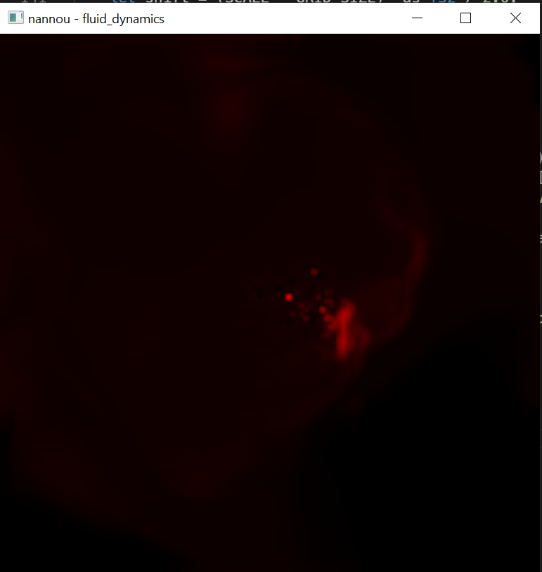

This is a very crude port of [Mike Ash's fluid dynamics code](https://mikeash.com/pyblog/fluid-simulation-for-dummies.html) into Rust. I basically followed [Daniel Shifmann's code](https://github.com/CodingTrain/website/tree/master/CodingChallenges/CC_132_FluidSimulation) and used nannou for a Processing displacement. One difference is that, using nannou's simple draw functions was extremely slow so I ported drawing part to vulkan.

I've tested the code on both Windows and macOS.

